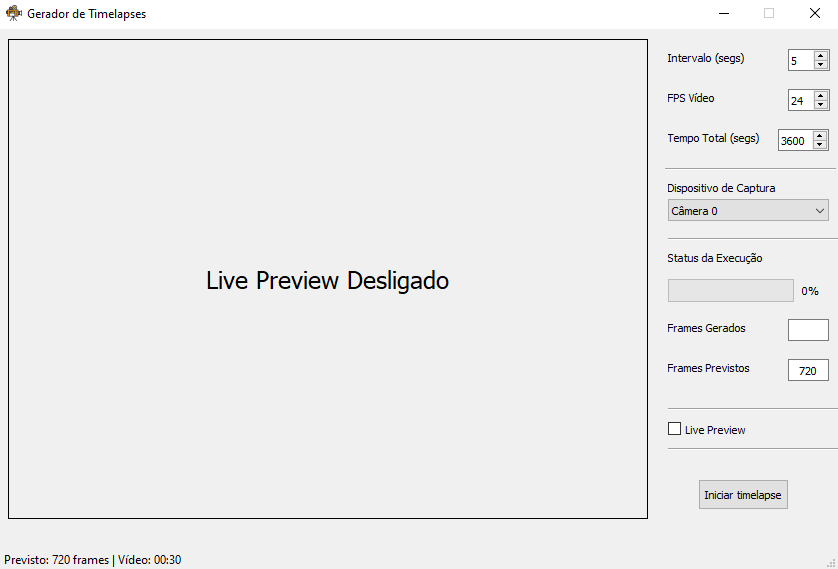
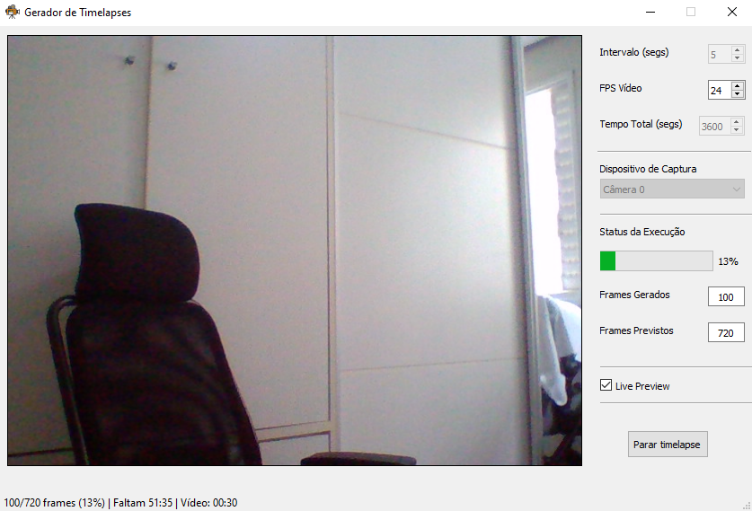
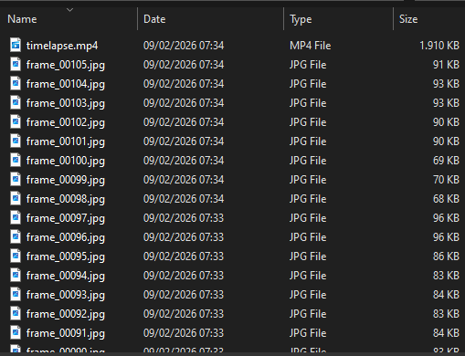

# Webcam Timelapse (PyQt + OpenCV)


Aplicação desktop em `Python` para captura de imagens em intervalos configuráveis a partir de webcams, com geração automática de vídeos em formato timelapse.

Desenvolvida com `PyQt5` e `OpenCV`, priorizando estabilidade, controle de recursos e boa experiência de uso.

---

## 📑 Sumário

- [Funcionalidades](#funcionalidades)
- [Screenshots](#screenshots)
- [Requisitos](#requisitos)
- [Como Executar o Programa](#como-executar-o-programa)
- [Como Usar o Programa](#como-usar-o-programa)
- [Parâmetros Importantes](#parâmetros-importantes)
- [Decisões Técnicas](#decisões-técnicas)
- [Limitações Conhecidas](#limitações-conhecidas)
- [Próximos Passos](#próximos-passos)
- [Licença](#licença)

---

## Funcionalidades

- Detecção automática de múltiplas webcams
- Troca de câmera durante o preview
- Preview ao vivo opcional (pode ser desativado para economizar recursos)
- Captura de imagens em intervalos configuráveis
- Contador de frames gerados e previstos
- Barra de progresso da captura
- Contagem regressiva do tempo restante
- Geração automática de vídeo timelapse via ffmpeg
- Seleção de pasta de saída
- Abertura automática da pasta ao finalizar
- Interface gráfica com Qt Designer

---

## Screenshots

### Preview da Câmera:

---
### Captura em Andamento:

---
### Resultado Final:


---

## Requisitos

**Requisitos do Sistema**:
- `Python 3.10+`
- `ffmpeg` (disponível no `PATH`)
- Sistema Operacional: `Windows`
- Webcam compatível com `OpenCV`

**Bibliotecas Python**:
- `PyQt5`
- `opencv-python`

### Instalação das bibliotecas Python:

As dependências Python podem ser instaladas com:

> `pip install -r requirements.txt`

### Instalação do ffmpeg (Windows):

> https://ffmpeg.org/download.html

- Adicione o executável ao `PATH` do sistema
- Teste no terminal: `ffmpeg -version`

## Como executar o programa

Clone o repositório e execute:
`python timelapse.py`

Certifique-se de que os arquivos abaixo estejam na mesma pasta:

```
timelapse.py
camera.ui
requirements.txt
icone.png
```

## Como usar o programa

- Abra o aplicativo
- Selecione a webcam desejada
- Ajuste:
	- Intervalo entre capturas (segundos)
	- Tempo total de captura (segundos)
	- FPS do vídeo final
- (Opcional) Desative o Live Preview para economizar recursos
- Clique em Iniciar timelapse
- Escolha a pasta de saída
- Aguarde o término da captura e a geração automática do vídeo
	- Caso a captura seja interrompida antes do tempo previsto, o programa gera o vídeo normalmente com os frames já capturados
- O vídeo final (timelapse.mp4) será gerado automaticamente dentro da pasta escolhida.

---

## Parâmetros importantes

- **Intervalo (segs)**: Define o tempo entre cada imagem capturada.

- **Tempo Total (segs)**: Define a duração total da captura.

- **FPS do Vídeo**: Controla a fluidez e a duração do vídeo final.
	- **Obs.**: não influencia a captura, apenas a renderização.

---

## Decisões técnicas

- Interface desenhada no `Qt Designer` para facilitar manutenção e evolução
- Separação clara entre:
  - Preview ao vivo / Captura de frames / Renderização do vídeo
- Uso de `QTimer` para evitar loops bloqueantes e travamento da UI
- Captura baseada no último frame válido para reduzir acesso concorrente à webcam
- Geração de vídeo via `QProcess` para manter a interface responsiva
- Tratamento de drivers instáveis e silenciamento controlado de logs do `OpenCV`

---

## Limitações conhecidas

- Webcams com drivers problemáticos podem apresentar atrasos ao abrir
- O ffmpeg deve estar corretamente configurado no PATH
- A estabilidade da captura depende da qualidade e dos drivers da webcam selecionada

---

## Próximos passos

- Empacotamento em .exe (PyInstaller)
- Presets de timelapse (ex: pôr do sol, construção, plantas)
- Adicionar opção para configurar a resolução de captura da câmera
- Logs de execução opcionais

---

## Licença
- Este projeto está licenciado sob a Licença MIT. Consulte o arquivo `LICENSE` para mais detalhes.


